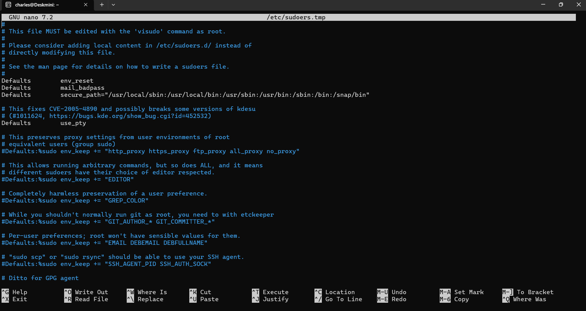
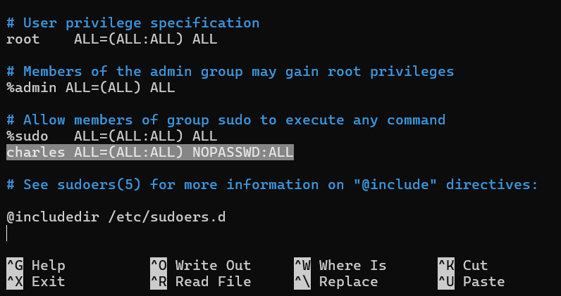

:::warning ⚠️ 安全性警告
這個設定會讓特定使用者在執行 sudo 時不用輸入密碼，
方便本地測試與開發操作，若為**對外開放的伺服器則不建議使用**。
:::

## 修改 sudoers 檔案

1. 以 root 權限編輯 sudoers 檔案

```bash
sudo visudo
```



2. 滾輪滑到最下方，在 `%sudo ALL=(ALL:ALL) ALL` 下方新增一行

> 將 `<username>` 替換為你的使用者名稱

```bash
<username> ALL=(ALL:ALL) NOPASSWD: ALL
```



3. 按下 `Ctrl + S` 儲存檔案，再按下 `Ctrl + X` 關閉編輯器
