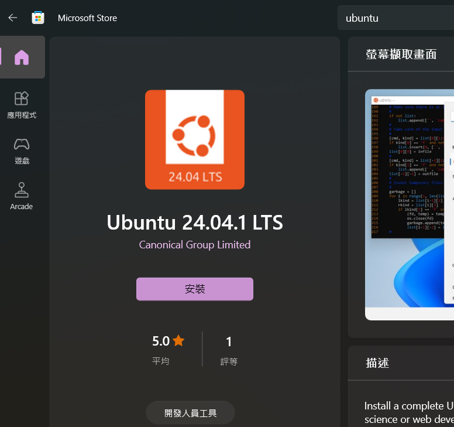
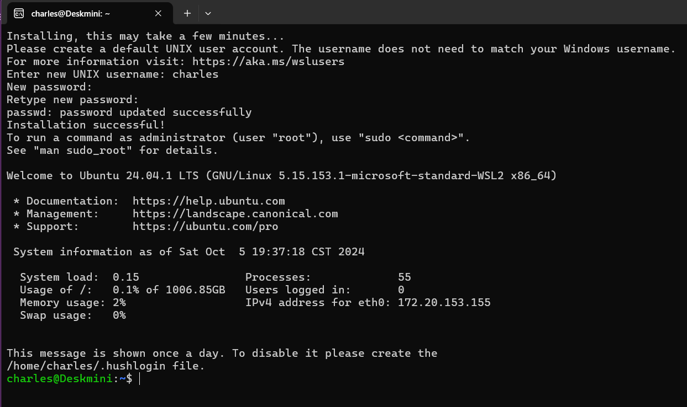
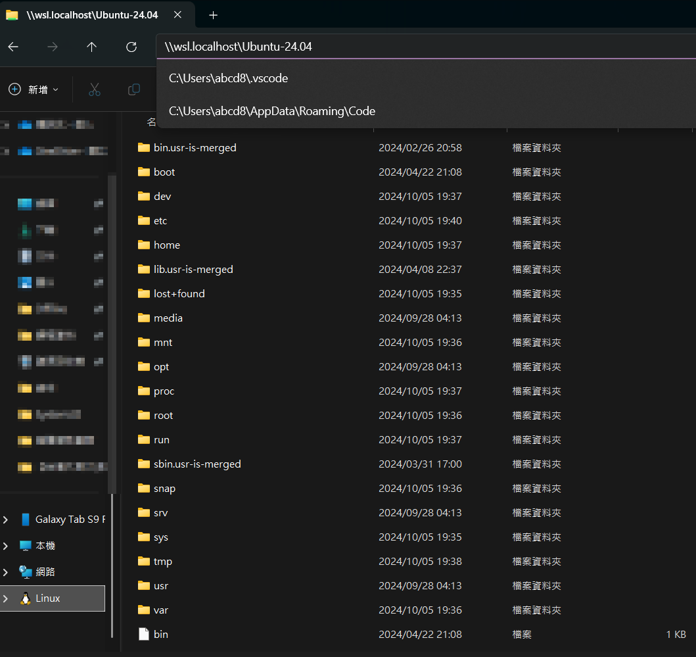
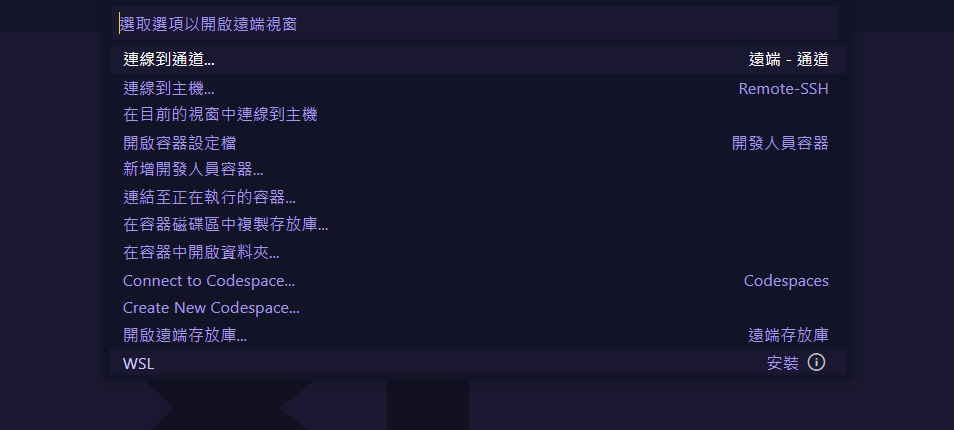
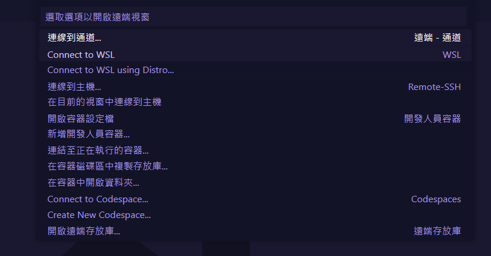
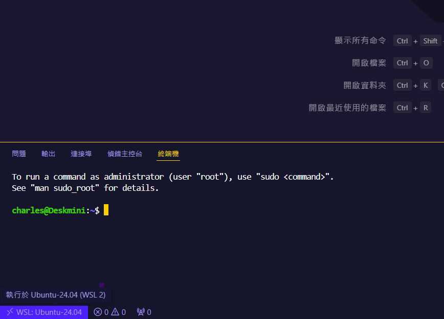
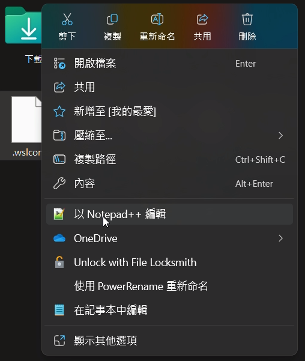

## 什麼是 WSL

Windows Subsystem for Linux (WSL) 可以讓你在 Windows 上運行 Linux 環境。你可以在不用安裝雙系統或是虛擬機 (VM) 的方式，以子系統的方式直接安裝任何 Linux 發行版在 Windows 上。只需要透過指令或應用程式啟動 WSL，幾秒鐘之後就可以喚醒一個完整的 Linux 系統。

WSL 目前版本 (2024 年 10 月) 為 WSL 2，目前發展的已經相當完善，可以簡易設定需要分配多少硬體資源給 Linux 系統，並且許多方便的功能都是開箱即用，例如網路共享、跨系統存取檔案等等。

## 如何操作 WSL

你可以用 Windows 的檔案總管以圖形化的方式來存取 WSL 的檔案，也可以透過 CMD 或 PowerShell 進入指定的 Linux Distro 來操作完整的 Linux 系統。

## 以 Windows 11 安裝 WSL，指定 Ubuntu 24.04 LTS

- 參考官方文件：[🔗 安裝 WSL](https://learn.microsoft.com/zh-tw/windows/wsl/install)
  > 若使用 Win 10，可以參考官網教學：[🔗 Windows 10 安裝 WSL](https://learn.microsoft.com/zh-tw/windows/wsl/install-manual)

1. 以管理員身分開啟 PowerShell 並執行以下指令

> 啟用 WSL 子系統與虛擬機器平台

```PowerShell
dism.exe /online /enable-feature /featurename:Microsoft-Windows-Subsystem-Linux /all /norestart
dism.exe /online /enable-feature /featurename:VirtualMachinePlatform /all /norestart
```

> 若遇到錯誤，可以嘗試也啟用 Hyper-V，並重啟電腦

```PowerShell
# 若上面指令都沒有問題，可以跳過這個步驟
dism.exe /online /enable-feature /featurename:Microsoft-Hyper-V /all /norestart
dism.exe /online /enable-feature /featurename:Microsoft-Hyper-V-Hypervisor /all /norestart
```

1. 到 [Microsoft Store 安裝 Ubuntu 24.04 LTS](https://apps.microsoft.com/detail/9nz3klhxdjp5?hl=zh-tw&gl=TW)
   
2. 安裝完成後直接點擊開啟，會跳出視窗開始自動安裝
3. 輸入使用者名稱與密碼，完成安裝

   > 密碼在輸入時不會顯示，輸入完後按下 Enter 即可

   

## 進入 WSL 的幾種方式

- 透過終端機進入

  輸入 `wsl` 或 `bash` 即可進入 WSL
  

- 透過 Windows 檔案總管

  在檔案總管的左側選單可以看到 WSL 的 Distro，點擊進入後即可透過檔案總管操作 WSL 的檔案
  

- 透過 VS Code 開啟 WSL

  1. 點擊左下角的連結圖示
     
  2. 找到 WSL 選項，第一次會提示需要安裝，點擊後會自動安裝
     
  3. 再次點擊左下角的連結圖示，選擇 `Connect to WSL` (或 `連線到 WSL` )，即可開啟 WSL 的 VS Code
     

     

     

## 配置 WSL 設定檔

透過 .wslconfig 檔案可以設定 WSL 的硬體資源分配，例如 CPU、記憶體等等。

1. 使用檔案總管進入 `%userprofile%` 目錄
2. 新增一個文字檔，命名為 `.wslconfig` 檔案
   右鍵以記事本或任何文字編輯器開啟
   

   寫入以下內容，可以自行調整硬體資源

   ```bash
   [wsl2]
   memory=8GB
   processors=6
   ```

   > 更多設定參數可以參考官方文件：[🔗 WSL 2 設定檔](https://learn.microsoft.com/zh-tw/windows/wsl/wsl-config#main-wsl-settings)
