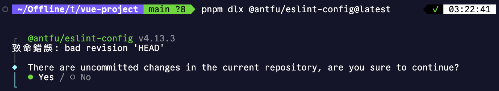
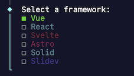
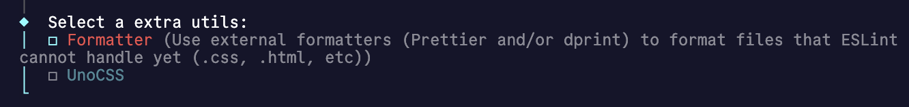
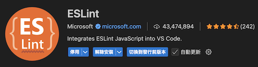

## 認識 ESLint

ESLint 是一種 Linter 工具，主要用於檢查 JavaScript 和 TypeScript 程式碼中的語法錯誤和程式碼風格問題。它能夠幫助開發者維持一致的程式碼風格，並在開發過程中及早發現潛在的錯誤。

在 Vue 或是 Nuxt 等等的專案中，我們可以使用 ESLint 來檢查程式碼風格，有助於在設計程式邏輯時提早注意潛在問題，避免潛在的錯誤被忽略，造成日後專案莫名的 bug 無從分析。也讓團隊成員在撰寫程式碼時能夠維持一致的風格，讓程式碼更易於閱讀和維護。

## 相容性問題

在 ESLint 9.x 版本之後，ESLint 的設定檔已經扁平化，避免了之前版本中多層級設定檔的複雜性。但也讓一些舊版的設定檔無法直接使用，對於新手入門在閱讀官方文檔與爬文時，可能會遇到一些困難。這篇文章將帶你快速配置新版 ESLint 9.x 的扁平化設定檔，包含格式化與自定義檢測規範。

## 準備環境

- Node.js v18.18.0 或以上版本
  > [🔗 參考文章](/nodejs/nvm/)
- pnpm 或其他套件管理工具
  > [🔗 參考文章](/nodejs/package-manager/)

## 安裝 ESLint

以下以 Vue 專案為例，使用 pnpm 安裝 ESLint。
並且透過 [🔗 GitHub - antfu/eslint-config](https://github.com/antfu/eslint-config) 這個套件來快速配置 ESLint。

- 執行以下指令安裝 ESLint 與準備好的設定檔

```bash
pnpm dlx @antfu/eslint-config@latest
```

如果專案沒有初始化 git 或是還有未 commit 的變動，會出現以下提示：

> 
> 透過方向鍵選擇 yes 並按 Enter 執行即可

- 選擇你的專案框架類型

  > 
  > 此處我們用空白鍵選 Vue，若為 Nuxt 框架一樣可以選擇 Vue。

- 選擇是否需要額外的 utils

  > 
  > 若有需要可以選取，此處我們不選擇，直接按 Enter 繼續即可。

- 自動更新 vscode 的設定檔

  > 
  > 建議選 yes，這只會影響到當前專案的 VS Code 設定檔，不會影響到全域設定。

- 安裝依賴套件

```bash
pnpm install
```

- package.json 加入 script
  - 透過 `pnpm lint` 執行檢查程式碼
  - 透過 `pnpm lint:fix` 檢查後嘗試自動修復程式碼中的問題
  ```javascript:line-numbers{5-6}
  {
    // ...
    "scripts": {
      // ...
      "lint": "eslint .",
      "lint:fix": "eslint . --fix"
    }
    // ...
  }
  ```

這樣就完成了 ESLint 的安裝與基本配置。

## 安裝 VS Code 擴充套件

為了在 VS Code 中更好地使用 ESLint，我們需要安裝相關的擴充套件。

> [🔗 ESLint](https://marketplace.visualstudio.com/items?itemName=dbaeumer.vscode-eslint)



## 自定義規則

接下來，我們可以根據專案需求，自定義 ESLint 的檢查規則。

以下是一些常見的自定義規則範例：

- **禁止使用 var**：強制使用 let 或 const 取代 var。
- **強制使用單引號**：要求使用單引號而非雙引號。
- **檢查未使用的變數**：報告未使用的變數以保持程式碼整潔。

由於 antfu 的 ESLint 設定檔已經包含了許多常用的規則，我們可以先使用這些預設規則，然後再根據專案開發過程遇到 ESLint 的警告或錯誤，逐步調整和添加自定義規則。

若要自定義規則，只需要打開稍早自動建立的 `eslint.config.js` 檔案，並在 `rules` 區塊中添加或修改規則即可。例如：

```javascript:line-numbers{5-10}
import antfu from '@antfu/eslint-config'

export default antfu({
  vue: true,
  typescript: true, // 若為 JS 專案沒用到 TS，則不必加這行

  rules: {
    'no-var': 'error', // 禁止使用 var
    'quotes': ['error', 'single'], // 強制使用單引號
    'no-unused-vars': 'warn', // 檢查未使用的變數
    // 可以在此添加更多自定義規則
  },
})
```

這樣就可以根據專案需求，自定義 ESLint 的檢查規則了。

## 補充

以下是我習慣的 VS Code 設定檔，包含了 ESLint 與 Prettier 的整合，讓程式碼格式化與檢查更為一致。

```js
import antfu from "@antfu/eslint-config";

export default antfu({
  vue: true,
  typescript: true,

  ignores: ["**/*.md"],

  rules: {
    "@stylistic/semi": ["error", "always"],
    "@stylistic/member-delimiter-style": [
      "error",
      {
        multiline: {
          delimiter: "semi",
          requireLast: true,
        },
        singleline: {
          delimiter: "semi",
          requireLast: false,
        },
      },
    ],
    "no-useless-escape": "off",
    camelcase: "error",
    "vue/eqeqeq": "error",
    "no-await-in-loop": "error",
    "require-atomic-updates": "error",
    "max-nested-callbacks": ["warn", 3],
    "no-return-await": "error",
    "vue/singleline-html-element-content-newline": "off",
    "vue/require-component-is": "off",
    "vue/max-attributes-per-line": [
      "error",
      {
        singleline: {
          max: 1,
        },
        multiline: {
          max: 1,
        },
      },
    ],
    "style/indent": "off",
    "vue/script-indent": ["error", 2, { baseIndent: 1 }],
  },
});
```
