Node.js 是一個基於 Chrome V8 引擎的 JavaScript 運行環境，可以讓 JavaScript 在伺服器端運行，並且可以使用 NPM 等 Package Manager 來安裝第三方套件。現代的網頁前端開發也離不開使用 node.js 的 package，例如透過 Vite 建立本地開發伺服器與打包專案。

Node.js 的版本更新速度很快，因此我們需要一個工具來管理 Node.js 的版本，避免不同專案需要使用不同版本的 Node.js 時造成問題。

## 以 Ubuntu 安裝 NVM

- 參考官方文件：[🔗 nvm - GitHub](https://github.com/nvm-sh/nvm?tab=readme-ov-file#installing-and-updating)

1. 下載 install script

```bash
curl -o- https://raw.githubusercontent.com/nvm-sh/nvm/v0.40.1/install.sh | bash
```

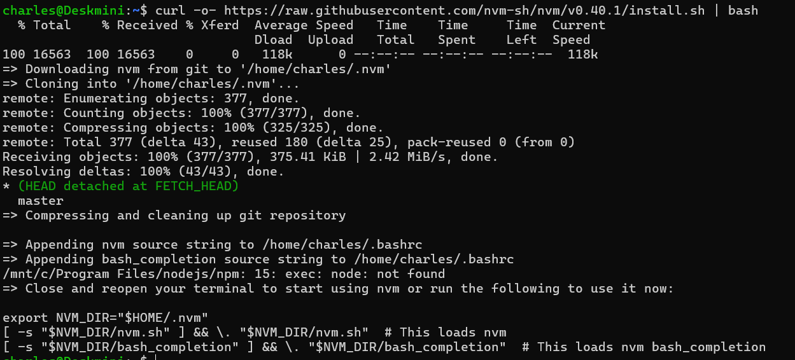

2. 設定環境變數

```bash
export NVM_DIR="$([ -z "${XDG_CONFIG_HOME-}" ] && printf %s "${HOME}/.nvm" || printf %s "${XDG_CONFIG_HOME}/nvm")"
[ -s "$NVM_DIR/nvm.sh" ] && \. "$NVM_DIR/nvm.sh" # This loads nvm
```

3. 查看最新的 Node.js LTS 版本

```bash
nvm ls-remote
```

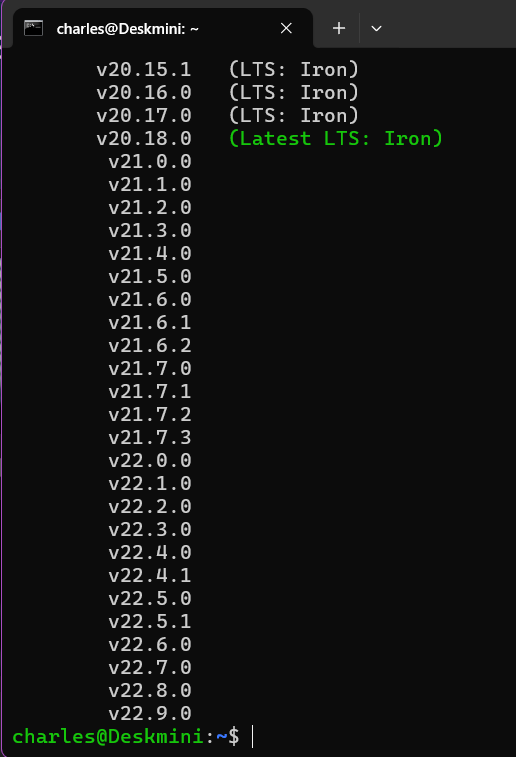

4. 安裝最新的 Node.js LTS 版本

```bash
nvm install 22.11.0
```

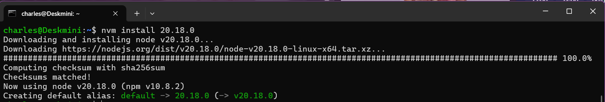

系統會自動將這個版本設定為預設

5. 確認 node, npm 的版本

```bash
node -v
npm -v
```

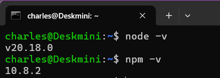

## 以 Windows 安裝 NVM

1. 開啟 PowerShell 並執行以下指令

```bash
winget search nvm
```

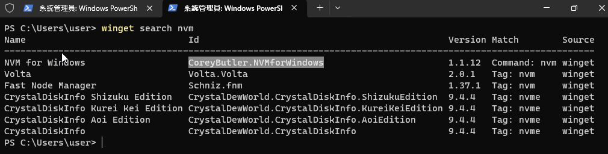

> 我們要的是 `CoreyButler.NVMforWindows`

2. 下載並安裝 NVM

```bash
winget install CoreyButler.NVMforWindows
```

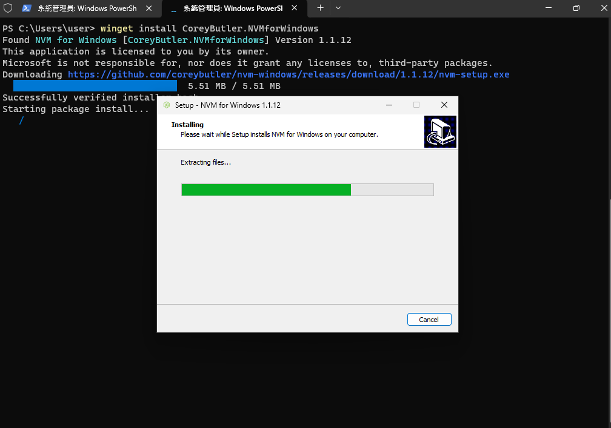
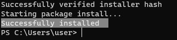

3. 看到 `Successfully installed` 後，重新開啟終端機並執行以下指令

```bash
nvm -v
```

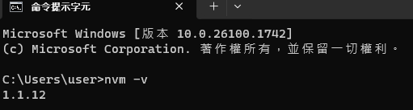
有出現版本號表示安裝成功

4. 安裝最新的 Node.js LTS 版本

```bash
nvm install lts
```

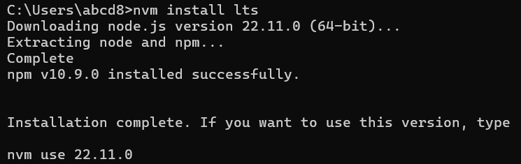
這邊顯示我們安裝的版本是 22.11.0，我們指定它為預設版本

5. 啟用指定的版本

```bash
nvm use 22.11.0
```

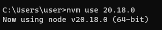

6. 完成後，可以檢查 node 跟 npm 的版本

```bash
node -v
npm -v
```

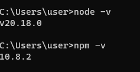

## 以 MacOS 安裝 NVM

1. 開啟終端機並執行以下指令

```bash
brew install nvm
```

2. 建立 nvm 的目錄

```bash
mkdir ~/.nvm
```

3. 設定環境變數

```bash
nano ~/.zshrc
```

在檔案最後加入以下內容

```bash
export NVM_DIR="$HOME/.nvm"
export NVM_HOME="/opt/homebrew/opt/nvm"
[ -s "$NVM_HOME/nvm.sh" ] && \. "$NVM_HOME/nvm.sh"
```

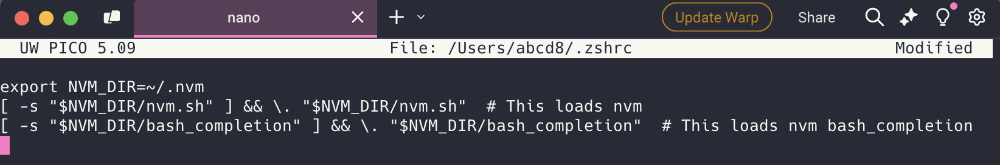

按下 Ctrl + O 儲存後按下 Enter，再按下 Ctrl + X 退出

4. 重新載入設定

```bash
source ~/.zshrc
```

5. 確認 nvm 是否安裝成功

```bash
nvm -v
```

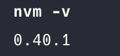
有出現版本號表示安裝成功

6. 查看最新的 Node.js LTS 版本

```bash
nvm ls-remote
```

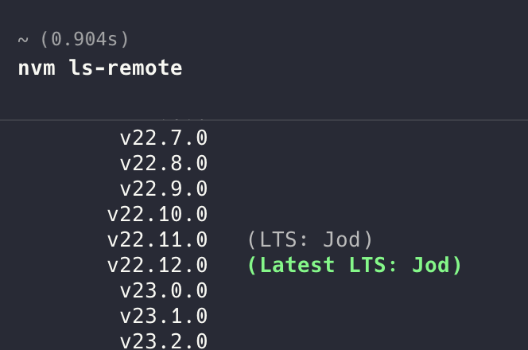

7. 安裝最新的 Node.js LTS 版本

```bash
nvm install 22.12.0
```

系統會自動將這個版本設定為預設

8. 確認 node, npm 的版本

```bash
node -v
npm -v
```

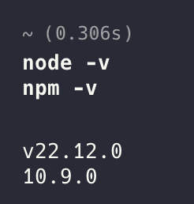

## 常用指令列表

- `nvm ls`：列出所有已安裝的 Node.js 版本
- `nvm ls-remote`：列出所有可安裝的 Node.js 版本
- `nvm install <version>`：安裝指定的 Node.js 版本
- `nvm use <version>`：啟用指定的 Node.js 版本
- `nvm alias default <version>`：設定預設的 Node.js 版本
- `nvm uninstall <version>`：移除指定的 Node.js 版本
- `node -v`：查看目前使用的 Node.js 版本
