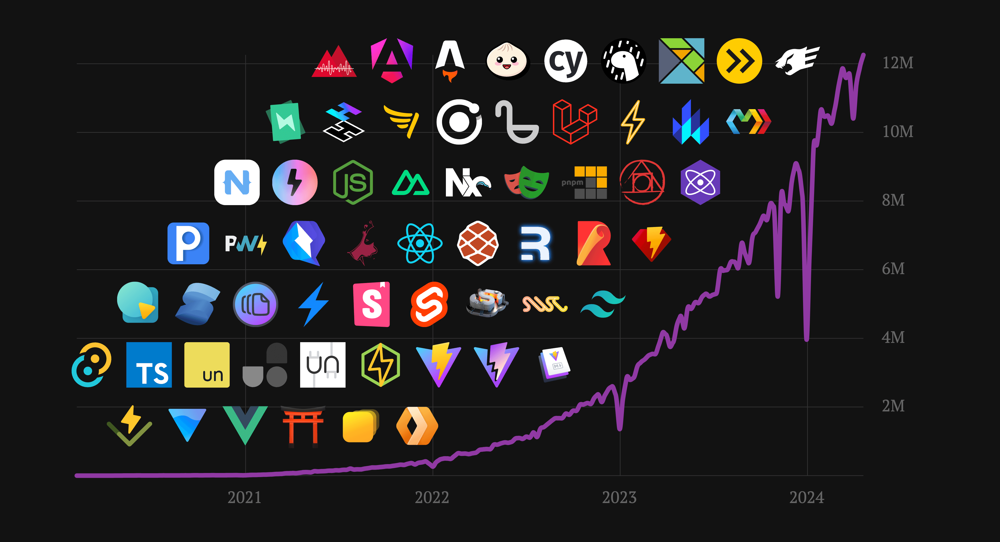
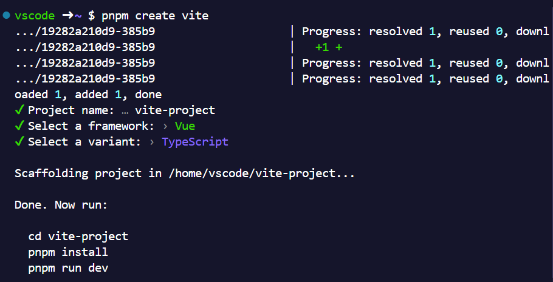
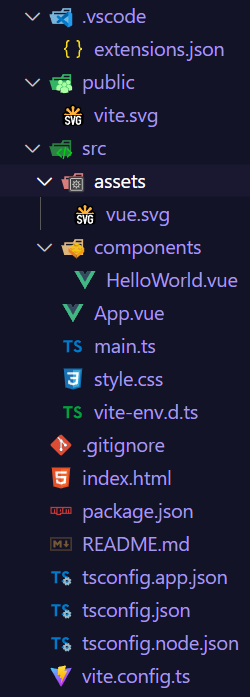

## 為什麼選擇 Vite

Vite 是近 3 年來最受歡迎的前端開發工具之一，在 state of javascript 2021 ~ 2023 中，在 [Library Tier List](https://2023.stateofjs.com/en-US/libraries/#tier_list) 皆為 S Tier，且留用率蟬聯第一名。



> Vite 的生態系豐富，下載量成長也相當迅速，目前已經超過 1500 萬次下載量，並且在 GitHub 上的 Star 數也達到 67.8k，超過了 webpack。

Vite 提供了一個極為快速的開發環境，並且支援熱模組替換（HMR）功能，讓開發者可以在開發過程中即時看到修改後的效果，並且不需要重新整理頁面。

在打包方面，相較於前一個世代的打包工具 webpack 的速度更快、打包後的檔案更小，即便 Webpack 積極優化下差距逐漸減少，但目前使用 Vite 的檔案異動後重新打包的速度仍然是 Webpack 的數倍，且 Vite 6 也將以 Rolldown (以 Rust 重寫的 Rollup) 作為打包工具，進一步提升打包速度。

## 安裝 Vite

想要使用 Vite 作為前端框架的開發工具，需要先配置 node.js，以下我們以 Vite 搭配 Vue.js 建立一個專案為例。

:::tip ℹ️ 提示
若尚未安裝 node.js，參考這篇教學 [📝用 NVM 管理 Node.js 版本
](/nodejs/nvm/)
:::

```bash
pnpm create vite
```



產生的資料夾結構如下：



- package.json

```json:line-numbers {6-10}
{
  "name": "vite-project",
  "private": true,
  "version": "0.0.0",
  "type": "module",
  "scripts": {
    "dev": "vite",
    "build": "vue-tsc -b && vite build",
    "preview": "vite preview"
  },
  "dependencies": {
    "vue": "^3.5.10"
  },
  "devDependencies": {
    "@vitejs/plugin-vue": "^5.1.4",
    "typescript": "^5.5.3",
    "vite": "^5.4.8",
    "vue-tsc": "^2.1.6"
  }
}
```

其中 script 已經預填 Vite 最常用的指令，`dev` 用於開發模式，`build` 用於打包，`preview` 用於預覽打包後的檔案。

透過 `pnpm dev` 即可啟動開發伺服器，所有的變更都會即時更新到瀏覽器中。

更多指令參數可以參考 [🔗Vite Command Line Interface](https://vite.dev/guide/cli#command-line-interface)
