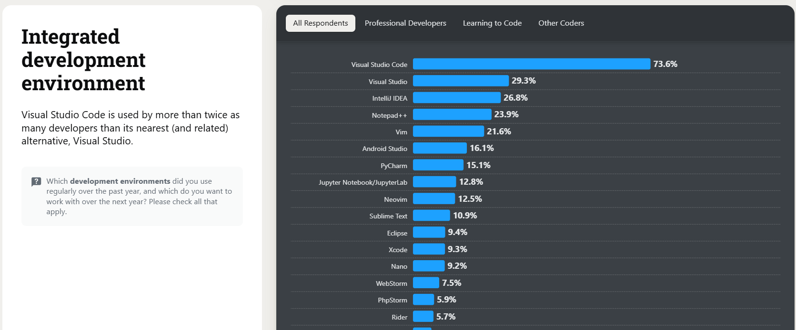

## 什麼是 VS Code

VS Code 全名為 Visual Studio Code，是由 Microsoft 開發的一款開源程式碼編輯器，支援多種程式語言，並提供豐富的擴充功能，讓開發者可以根據自己的需求進行客製化。

以單獨編輯檔案而言，VS Code 相對於大型 IDE 更輕量，因此可以快速啟動，並且內建許多方便的快捷鍵。而要進行專案開發時，透過豐富且完備的擴充套件，可以實現客製化 IDE 的效果。

## VS Code 有多受歡迎



根據 [Stack Overflow Developer Survey](https://survey.stackoverflow.co/2024/technology#1-integrated-development-environment) 的調查，VS Code 已經蟬聯數年都是輾壓其他 IDE 為最受歡迎程式碼編輯器。

## 安裝 VS Code

### Ubuntu 以瀏覽器下載安裝 VS Code

1. 到 [VS Code 官網](https://code.visualstudio.com/Download) 下載 deb 檔案。
2. 開啟 Terminal，切換到下載目錄。
3. 使用 dpkg 安裝 deb 檔案。

```bash
sudo dpkg -i code_1.94.2-1728494015_amd64.deb
```

> 請注意，版本號可能會有所不同，請以下載的檔案名稱為準，輸入 code 以 tab 鍵自動補全檔案名稱。

### Ubuntu 以指令安裝 VS Code

```bash
echo "code code/add-microsoft-repo boolean true" | sudo debconf-set-selections
```

```bash
sudo apt-get install wget gpg
wget -qO- https://packages.microsoft.com/keys/microsoft.asc | gpg --dearmor > packages.microsoft.gpg
sudo install -D -o root -g root -m 644 packages.microsoft.gpg /etc/apt/keyrings/packages.microsoft.gpg
echo "deb [arch=amd64,arm64,armhf signed-by=/etc/apt/keyrings/packages.microsoft.gpg] https://packages.microsoft.com/repos/code stable main" |sudo tee /etc/apt/sources.list.d/vscode.list > /dev/null
rm -f packages.microsoft.gpg
```

```bash
sudo apt install apt-transport-https
sudo apt update
sudo apt install code
```

### Windows 安裝 VS Code

Windows 安裝相對簡單，除了到官網下載或 Microsoft Store 安裝外，也可以透過 winget 指令安裝。

打開終端機，輸入以下指令：

```bash
winget install vscode
```

即可完成安裝。

## VS Code 的進階應用

- 設定檔管理
  設定檔可以記錄你的喜好設定、快捷鍵、Task 工作、snippets 程式碼片段、擴充套件，讓你在不同專案間輕鬆切換，避免在不同專案加載多餘的擴充套件以提升效能。

- 設定檔同步與雲端變更
  透過設定檔同步功能，可以將設定檔儲存到雲端，讓你在不同裝置上使用 VS Code 時，可以同步設定檔，不必重新設定。

- dev container

  使用 dev container 可以在 docker 容器中開發，不必擔心本機環境的設定，只要有安裝 Docker，即可讓任何電腦、作業系統上的 VS Code 在開啟相同專案時得以確保以完全一致的開發環境進行開發，這對於團隊協作有很大的幫助。

- 連線到遠端主機 (SSH)

  透過 Remote-SSH 擴充套件，可以在 VS Code 的相同介面直接連線到遠端主機進行開發，開啟目標主機的資料夾，修改其檔案並執行指令。

- 連線到 GitHub Codespace

  與 Remote-SSH 類似，GitHub Codespace 可以讓你在瀏覽器中開啟 VS Code，並連線到 GitHub 上的專案進行開發。也可以在 VS Code 應用程式中直接開啟連線開發。

- 連線到遠端通道 (Remote Tunnels)

  透過 Remote Tunnels 擴充套件，可以在 VS Code 中建立遠端通道連線，不必設定 SSH 伺服器，以 GitHub 帳號或 Microsoft 帳號驗證身分，就能讓內外網任何可連網裝置以 VS Code 應用程式或是網頁版 VS Code 進行遠端開發。
  甚至包含用平板、手機以瀏覽器存取完整的 VS Code 功能與擴充套件。

## 參考我的設定檔

- [設定檔 - GitHub](https://github.com/Charles5277/vscode_setting_config)
