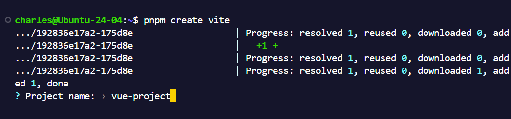
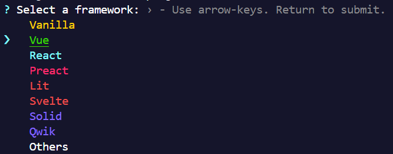
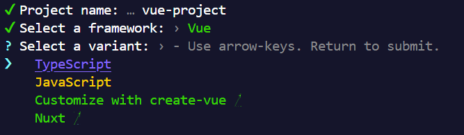
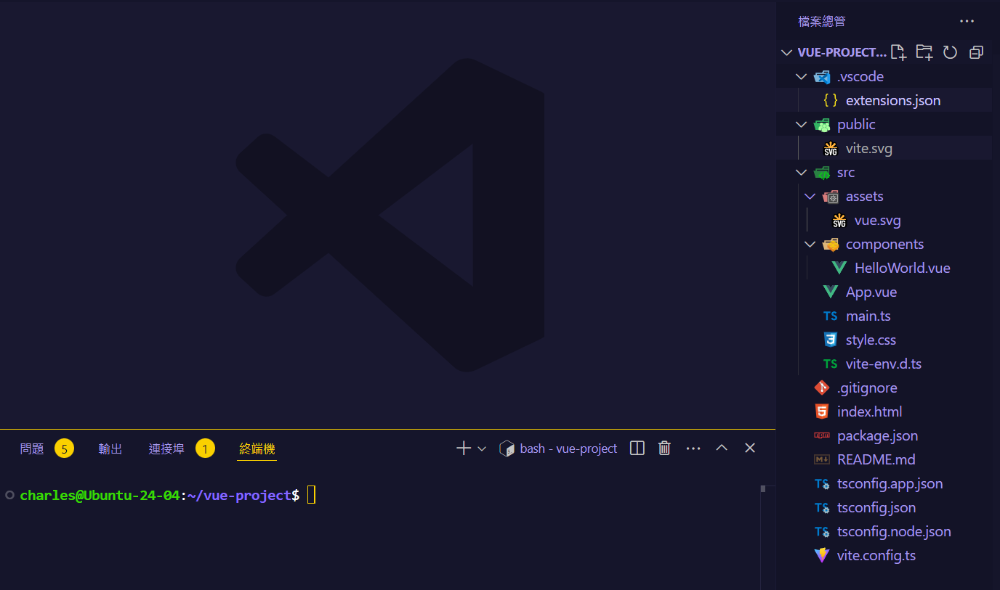
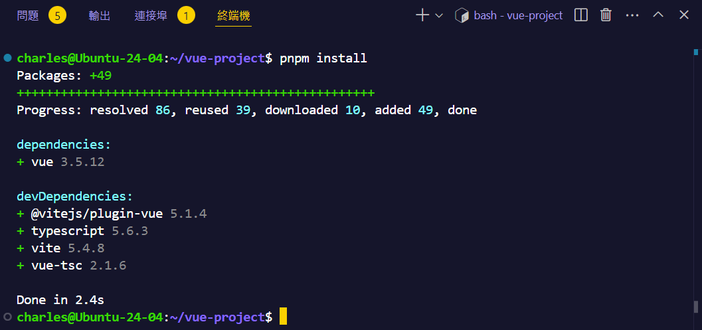

## 準備環境

- Node.js 環境 [🔗參考](/nodejs/nvm/)
- pnpm 套件管理器 [🔗參考](/nodejs/package-manager/)
- VS Code 編輯器 [🔗參考](/vscode/intro/)

## 建立專案

1. 開啟資料夾到你想要建立專案的位置。
   > 可以使用 Ctrl + K Ctrl + O 快捷鍵開啟資料夾。
2. 在 VS Code 開啟終端機
   > 可以使用 Ctrl + J 或 Ctrl + \` 快捷鍵開啟終端機。
3. 執行以下指令建立專案

```bash
pnpm create vite
```

- 輸入專案名稱
  

- 按上下鍵選擇 Vue，按 Enter 鍵確認
  

- 選擇 TypeScript 或 JavaScript
  

- 重新選擇專案資料夾，進入剛才建立的專案資料夾
  

  

- 安裝專案相依套件

  ```bash
  pnpm install
  ```

  

- 啟動開發伺服器

  ```bash
  pnpm dev
  ```

  

- 按住 Ctrl + 滑鼠點擊網址，即可在瀏覽器開啟專案
  

## 專案架構說明

```
.
├── README.md
├── index.html
├── node*modules
│ ├── @vitejs
│ │ └── plugin-vue -> ../.pnpm/@vitejs+plugin-vue@5.1.4_vite@5.4.8_vue@3.5.12_typescript@5.6.3*/node_modules/@vitejs/plugin-vue
│ ├── typescript -> .pnpm/typescript@5.6.3/node_modules/typescript
│ ├── vite -> .pnpm/vite@5.4.8/node_modules/vite
│ ├── vue -> .pnpm/vue@3.5.12_typescript@5.6.3/node_modules/vue
│ └── vue-tsc -> .pnpm/vue-tsc@2.1.6_typescript@5.6.3/node_modules/vue-tsc
├── package.json
├── pnpm-lock.yaml
├── public
│ └── vite.svg
├── src
│ ├── App.vue
│ ├── assets
│ │ └── vue.svg
│ ├── components
│ │ └── HelloWorld.vue
│ ├── main.ts
│ ├── style.css
│ └── vite-env.d.ts
├── tsconfig.app.json
├── tsconfig.json
├── tsconfig.node.json
└── vite.config.ts
```

### 根目錄

- **README.md**: 專案的說明文件，包含專案的概述、安裝指引以及使用說明等資訊。
- **index.html**: 專案的入口 HTML 文件，Vite 會將 JavaScript 文件自動引入到這裡。
- **package.json**: 專案的配置文件，包含了專案的名稱、版本、依賴、指令等。
- **pnpm-lock.yaml**: pnpm 的版本鎖定文件，用來確保專案的依賴版本一致。

### 資料夾

- **node_modules/**: 這是專案的依賴目錄，所有的第三方依賴都會被安裝到這裡。
  - **@vitejs/plugin-vue**: Vite 的 Vue 插件，用來處理 Vue 單文件元件。
  - **typescript**: TypeScript 編譯器，用來編譯 TypeScript 文件。
  - **vite**: Vite 的核心框架，用來啟動開發伺服器、打包應用等。
  - **vue**: Vue.js 框架，用來構建 Vue 應用。
  - **vue-tsc**: Vue 的 TypeScript 編譯器，用來編譯 Vue 單文件元件中的 TypeScript。
- **public/**: 這是公共資源目錄，裡面的資源會被直接複製到打包後的目錄中。
  - **vite.svg**: 這是一個範例 SVG 圖片，會被複製到打包後的目錄中。
- **src/**: 這是專案的來源代碼目錄，包含了所有的 Vue 元件、樣式表、佈局、服務、模組、入口文件等。
  - **App.vue**: 這是 Vue 專案的根元件，集成了所有的子元件跟頁面。
  - **assets/**: 儲存各種靜態資源，像是圖片、字體等。
    - **vue.svg**: 範例 SVG 圖片，用來展示如何在 Vue 元件中引入靜態資源。
  - **components/**: 這是 Vue 元件目錄，用來存放所有的 Vue 元件。
    - **HelloWorld.vue**: 這是一個範例 Vue 元件，用來展示如何創建一個 Vue 元件。
  - **main.ts**: 應用的入口文件，用來初始化 Vue 應用。
  - **style.css**: 全域樣式表，用來定義全域的樣式規則。
  - **vite-env.d.ts**: Vite 的 TypeScript 宣告文件，提供一些全域的型別支援。
- **tsconfig.app.json**: 對於應用程式的 TypeScript 配置文件，主要針對專案的編譯選項進行設定。
- **tsconfig.json**: 通用的 TypeScript 配置文件，整體專案的型別檢查、編譯等規則。
- **tsconfig.node.json**: 針對 Node.js 環境的 TypeScript 配置。
- **vite.config.ts**: Vite 的配置文件，用來設定專案的各種打包與開發伺服器的行為。可以在這裡定義例如路徑別名、插件等等。
