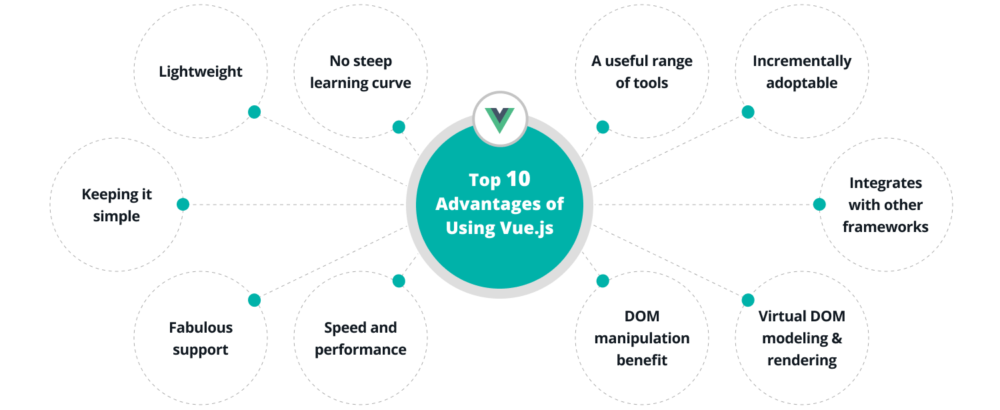
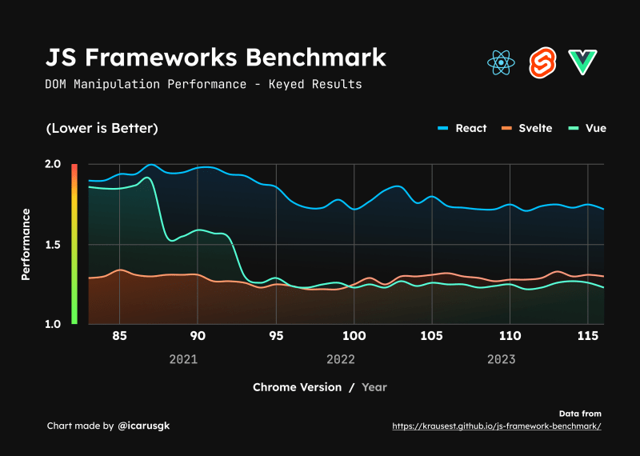

用於建立面向於 Desktop, Mobile, WebGL, Terminal 應用程式的前端。
由於 Vue.js 基於標準的 HTML、CSS 和 JavaScript 組成，因此最廣泛應用就是用在建立網頁。

## 使用 Vue.js 的主要場景

1. Single-Page Application (SPA)

   在使用網站時，只載入一個頁面，在網頁更新時渲染頁面，不需重新加載，提供更滑順的使用者體驗。

2. Fullstack / Server-Side Rendering (SSR)

   從伺服器端取得資料，再繪製出完整的 HTML 頁面，有助提高搜尋引擎優化 (SEO) 與首次載入速度。

3. Jamstack / Static Site Generation (SSG)

   靜態網站生成：在部署前生成靜態 HTML，不需要在瀏覽器或服務器上進行渲染。

4. 作為 Web Component 遷入到任何頁面上

5. 希望無須任何建置就能單純增強 HTML 檔案的功能 (透過 CDN 引入)

## Vue.js 的特點和優勢

- 組件化架構

  Vue.js 以整合 HTML、CSS、JS 的單文件元件 (SFC) 為基礎，方便每個元件獨立測試，且程式碼較簡單易懂，有助於最佳化與除錯。

- 輕量級

  Vue.js 本體相當輕量，且支援懶加載 (lazy load)，只在需要時才加載元件，有助於提高網頁載入速度。

- 學習曲線平緩

  Vue.js 由簡入深，只要具有 HTML、CSS、JS 基礎知識就能快速學習並立即應用，能以少量程式碼快速得到成果。

- 豐富工具

  Vue.js 的開發社群日益壯大，有豐富的工具能夠實現進階的需求。

- 增量採用

  Vue.js 是漸進式框架，可以根據項目的需求逐步導入。如果需要也可以僅使用 CDN 引入在 HTML 檔案，即可使用 Vue 的強大功能。

- 與其他框架整合

  作為靈活的前端框架，Vue 可以輕鬆地與其他工具和框架整合，以滿足項目的具體需求

- 虛擬 DOM Model 和渲染

  Vue 使用虛擬 DOM，當頁面異動時，無需不斷重新渲染整個 DOM，提供相對於原生 JS 操作 DOM 更快的渲染速度。

  > 目前 Vue 也在開發 Vapor 模式以取代虛擬 DOM，再進一步達到更快的渲染速度。

- DOM 操控優勢

  透過雙向綁定功能，更新元件和追蹤數據更新相當簡單，綁定的數據可以像 DOM Object 一樣更新，因此在應用即時更新的情況下，Vue 表現特別靈活。

- 速度和性能

  當比其他前端框架，Vue 有相對更加卓越的反映速度與性能表現

  👇**與 React 跟 Svelte 比較，Vue 的性能表現更好**
  

- 日益壯大的社區支援與相關教學

  基於 Vue 的卓越特色，深受大量前端開發社群認可，目前有越來越多基於 Vue 的 Libraries、Utilities、Framework 誕生，且 Vue 仍在非常積極的更新與優化，並相當願意與開發社群討論未來發展的方向，是高速發展中且持續充滿活力的前端框架。

### 已經可見使用 Vue.js 搭建部分網頁的大型企業

### GitLab 在 7 年前即全面採用 Vue.js 的原因

[🔗 Why we chose Vue.js (gitlab.com)](https://about.gitlab.com/blog/2016/10/20/why-we-chose-vue)
