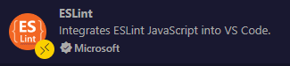

## 認識 ESLint 與 Prettier

ESLint 是一種 Linter，而 Prettier 是一種 Formatter。

在 Vue 專案中，我們可以使用 ESLint 來檢查程式碼風格，有助於在設計程式邏輯時提早注意潛在問題，避免潛在的錯誤被忽略，造成日後專案莫名的 bug 無從分析。而 Prettier 能夠幫我們自動格式化程式碼，不用再為了空格、縮排、分號、換行等等問題而浪費時間，讓我們專注在邏輯實作上。

## 相容性問題

在以前的版本，由於 ESLint 與 Prettier 有部份相衝突的規則，因此設定較為麻煩，而在 ESLint 9 之後，設定檔的寫法有所調整變成 flat 扁平化的結構，這篇教學提供 Vue 3 專案設定方式的懶人包。

## 安裝到 Vue 3 專案中

- 安裝 ESLint 與 Prettier 相關套件

```bash
pnpm add -D eslint @eslint/js eslint-plugin-vue typescript-eslint prettier
```

- 建立 config 檔

  > 於專案根目錄下建立 `eslint.config.js`
  > 你可以依照 [ESLint](https://eslint.org/docs/latest/rules/) 與 [eslint-plugin-vue](https://eslint.vuejs.org/rules/) 的規則自定義修改成你想要的規則

  ```js
  import js from '@eslint/js';
  import ts from 'typescript-eslint';
  import vue from 'eslint-plugin-vue';

  export default [
    {
      languageOptions: {
        ecmaVersion: 'latest',
      },
    },

    // js
    js.configs.recommended,

    // ts
    ...ts.configs.recommended,

    // vue
    ...vue.configs['flat/recommended'],
    {
      rules: {
        'no-useless-escape': 'off',
        eqeqeq: 'error',
        camelcase: 'error',
        'vue/eqeqeq': 'error',
        'no-async-promise-executor': 'error',
        'no-await-in-loop': 'error',
        'no-promise-executor-return': 'error',
        'require-atomic-updates': 'error',
        'max-nested-callbacks': ['warn', 3],
        'no-return-await': 'error',
        'prefer-promise-reject-errors': 'error',
        'prefer-const': 'error',
        'vue/singleline-html-element-content-newline': 'off',
        'vue/html-self-closing': 'off',
        'vue/max-attributes-per-line': 'off',
      },
    },
  ];
  ```

  > 於專案根目錄下建立 `.prettierrc`
  > 你可以依照 [Prettier](https://prettier.io/docs/en/options) 的規則自定義修改成你想要的規則

  ```json
  {
    "semi": true,
    "singleQuote": true,
    "quoteProps": "as-needed",
    "trailingComma": "all",
    "bracketSpacing": true,
    "bracketSameLine": false,
    "arrowParens": "always",
    "requirePragma": false,
    "insertPragma": false,
    "proseWrap": "preserve",
    "htmlWhitespaceSensitivity": "css",
    "vueIndentScriptAndStyle": true
  }
  ```

- 安裝 VS Code 擴充套件

  - [ESLint](https://marketplace.visualstudio.com/items?itemName=dbaeumer.vscode-eslint)
    
  - [Prettier - Code formatter](https://marketplace.visualstudio.com/items?itemName=esbenp.prettier-vscode)
    

- 設定 VS Code 設定檔

  你可以選擇基於使用者帳號設定，會對所有專案生效。或基於專案資料夾設定，只針對單一專案有效，優先級大於使用者帳號設定。

  - 使用者帳號
    透過 Ctrl + Shift + P 搜尋 JSON 選擇開啟使用者設定 (JSON)
    

  - 專案資料夾
    透過 Ctrl + Shift + P 搜尋 JSON 選擇開啟工作區設定 (JSON)
    

  > 加上這兩行到現有的 JSON 檔案中 (注意行尾逗號)

  ```json
  {
    "editor.formatOnSave": true,
    "editor.defaultFormatter": "esbenp.prettier-vscode"
  }
  ```

## 只用 ESLint 進行 Linting 與 Formatting?

如果你想只用 ESLint 就搞定 Lint 與 Format，可以參考 Antfu 大的 [eslint-config](https://github.com/antfu/eslint-config) 設定。

但我個人嘗試過後，還是選擇 Prettier 來幫我做格式化，因為部份設定例如 max-len 跟屬性自動換行的規則，靠純 ESLint 我暫時沒有找到合適的設定方式。這會讓我在寫程式時需要手動做許多排班的處理，而 Prettier 就能幫我自動處理這些問題。因此還是需要根據自己的需求來選擇！
